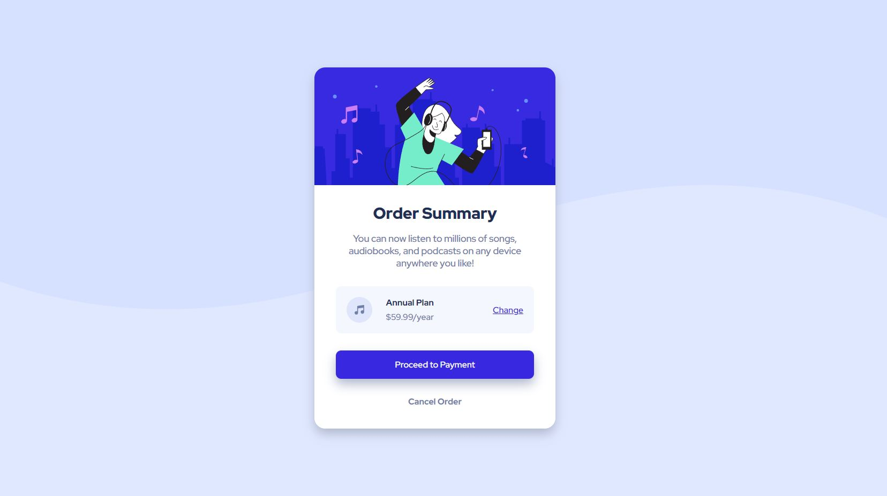

# Frontend Mentor - Order summary card solution

This is a solution to the [Order summary card challenge on Frontend Mentor](https://www.frontendmentor.io/challenges/order-summary-component-QlPmajDUj). Frontend Mentor challenges help you improve your coding skills by building realistic projects.

## Table of contents

-   [Overview](#overview)
    -   [The challenge](#the-challenge)
    -   [Screenshot](#screenshot)
    -   [Links](#links)
-   [My process](#my-process)
    -   [Built with](#built-with)
    -   [What I learned](#what-i-learned)
-   [Author](#author)

## Overview

### The challenge

Users should be able to:

-   See hover states for interactive elements

### Screenshot

### Links

-   Solution URL: [https://github.com/nkriedner/order-summary-challenge](https://github.com/nkriedner/order-summary-challenge)
-   Live Site URL: [https://nkriedner.github.io/order-summary-challenge/](https://nkriedner.github.io/order-summary-challenge/)

## My process

### Built with

-   Semantic HTML5 markup
-   CSS custom properties
-   Flexbox
-   Desktop-first workflow

### What I learned

The challenge was a nice way to repeat and practice basic HTML and CSS knowledge.

## Author

-   Website - [Add your name here](https://www.your-site.com)
-   Frontend Mentor - [@yourusername](https://www.frontendmentor.io/profile/yourusername)
-   Twitter - [@yourusername](https://www.twitter.com/yourusername)
